**SENG 438- Software Testing, Reliability, and Quality**

**Lab. Report \#5 – Software Reliability Assessment**

| Group 11:       |   |
|-----------------|---|
| Jam Ivy Gammuac |   |
| Thomas Kusinski |   |
| Austin Lee      |   |
| Shanelle Li Chit Khim |   |

# Introduction
This lab was conducted to gain experience with measuring the reliability of a system using reliability assessment tools. Two techniques of assessing failure data were used: reliability growth testing and reliability demonstration chart. The failure data we analyzed was the data contained in Failure Report #9 which was provided in the lab artifacts. The tools used for this lab were: SFRAT for reliability growth testing and RDC-11 excel sheet for the reliability demonstration chart. From these two exercises we were able to learn how to analyze test data to determine the reliability of an SUT, as well as gain an understanding of when it is useful to use different techniques of failure data assessment.

# 

# Assessment Using Reliability Growth Testing 
We used the testing tool SFRAT to analyze the data contained in Failure Report #9.

## Plots of Failure Data
Using SFRAT we generated time-between failure, failure intensity, and reliability graphs for the data in Failure Report #9.

### Time Between Failures Plot
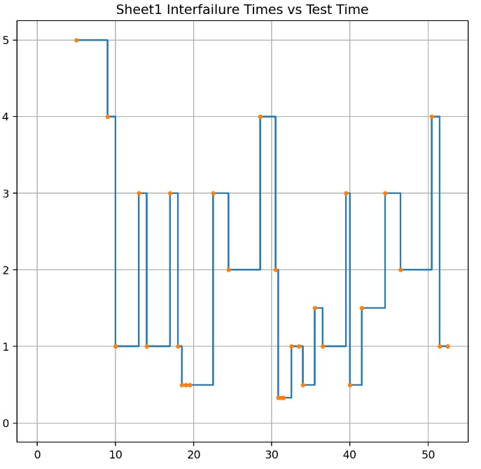

### Failure Intensity Plot
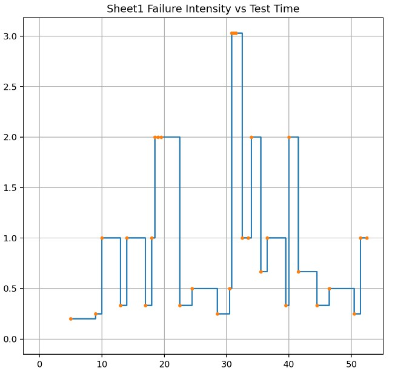

### Cumulative Failures Plot
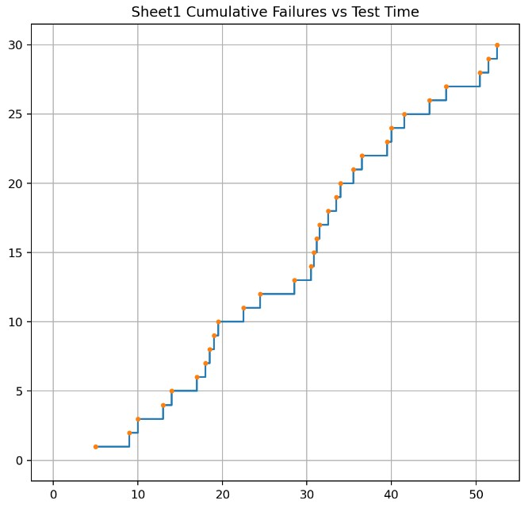

#

## Model Comparison (Determining top two models in SFRAT):
To compare the models, and determine which two models would provide the best fit for Failure Report #9, we used SFRAT to make predictions on the given data for every model that was available on SFRAT. 

### AIC scores of models
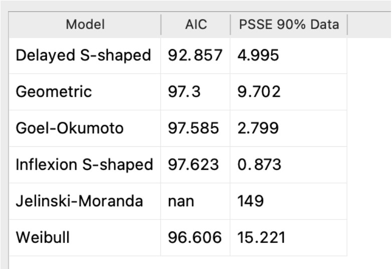

Best Two Models: Delayed S-shaped and Weibull models

Reasoning: To determine the top two models, we compared their AIC(Akaike Information Criterion) scores and PSSE (Predictive Sum of Squares Error). The AIC and PSSE evaluates how well a model fits its dataset, with a lower AIC and PSSE indicating a better goodness of fit, and a higher AIC and PSSE indicating a worse fit to the dataset and an increased likelihood to overfit. As a result, we see that the Inflexion S-shaped model and Delayed S-shaped model are the models that show the best goodness of fit for this dataset with respect to both the AIC and PSSE scores. For the Inflexion S-shaped model, while its AIC score may be narrowly beaten out by other models, it possesses the lowest PSSE out of all models so it makes the top two models. Similarly for the Delayed S-shaped model, it makes the top two models because it has the lowest AIC score and a relatively low PSSE as well.

## Model Predicition Plots

### Cumulative Failures Plot With All Model Predictions
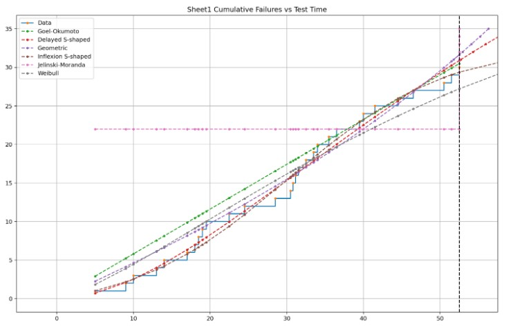

### Failure Intensity Plot With All Model Predictions
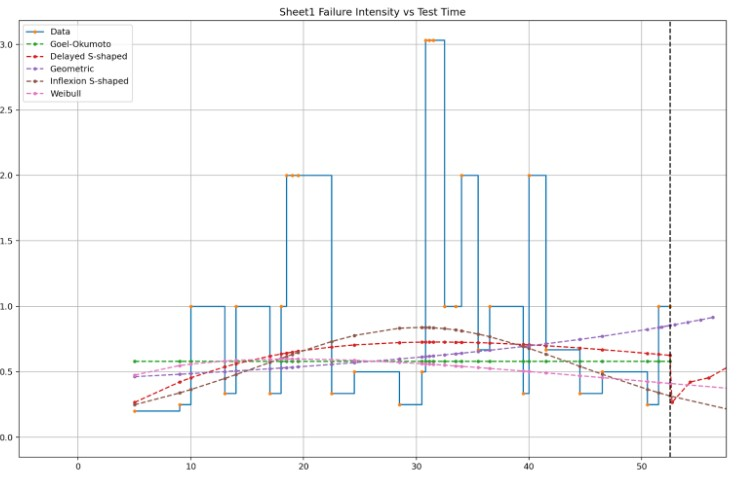

### Reliability Plot for SUT With All Model Predictions
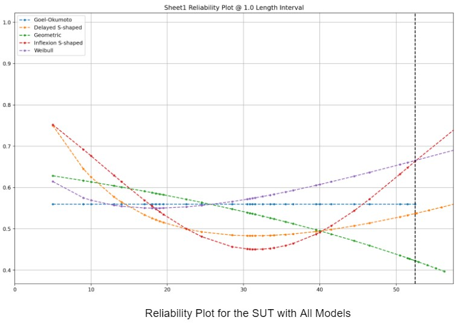

## Model Prediction Results:

Using SFRAT, we generated plots of the SUT with the predictions of the chosen Inflexion S-shaped model and the Delayed S-Shaped model. In the failure intensity graph, we can see that both models predict that the failure intensity decreases in the future with the Inflexion S-shaped model predicting a faster decrease in failure intensity. With respect to the reliability plot, both models predict that for future testing, there will be steady reliability growth with the Inflexion S-shaped model predicting a faster rate of reliability growth. 
#
## Range Analysis
We performed a range analysis on the dataset using SFRAT’s built in laplace test and Running Average Trend Test to help select the range of useful data.

### Laplace Test
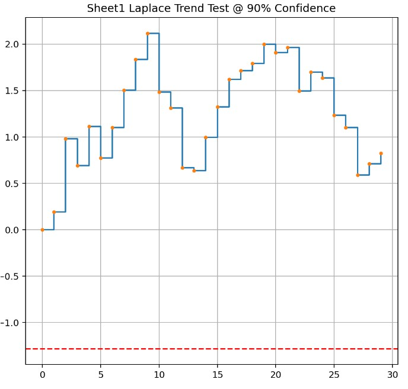

### Running Average Trend Test
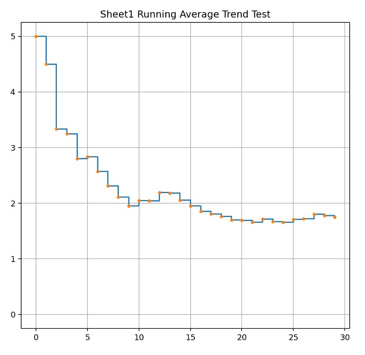

## Range Analysis Results: 
For the Laplace Trend test, an increase in the laplace factor indicates a decrease in reliability whereas a decrease in the laplace factor results in reliability growth. Based off the Laplace Trend Test performed on the data in Failure Report #9, (counting the actual dots because the x-axis did not work properly in the tool) we can see that the laplace factor is increasing between failures 0-10, 15-20, and 28-30, meaning that the reliability of the system is decreasing between these failures. The laplace factor is decreasing between failures 10-15 and 20-28, so between these failures the reliability of the system is increasing.

By analyzing the Running Average Trend test, we can see that the system is less reliable initially and becomes a lot more reliable as more failures occur. Therefore combining the results of the two tests, the most useful data for the current dataset would probably be the data between failures 15-30. However, since almost all the data points in the laplace test are values in between -2 and 2, this indicates stable reliability so basically all the data is useful. It is recommended though that more failure data is included as 30 failures is a smaller dataset.

#

## Decision Making Using a Given Failure Rate:
To make a decision about the system’s reliability, when using a given target failure rate as criteria, you should compare the target failure rate to what the system’s current failure rate is at and use the results of that comparison to guide your decision. For example if the system’s current failure rate is more than the target failure rate, this indicates more failures are occurring than what is acceptable so testing should continue as the system has not yet reached the target acceptable level of reliability. 

In our system under test, we used data from Failure Report #9. As displayed in the calculations below, we calculated the MTTF of the system and calculated the reciprocal of the calculated MTTF to obtain the system’s current failure rate at 0.00952381 failures per second. 

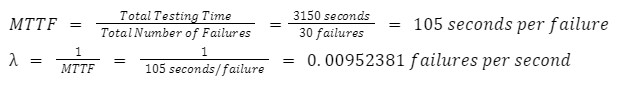

In this lab we were not provided with a target failure rate but, if the given target failure rate were to be a smaller value than our SUT’s current failure rate of 0.00952381 failures per second, then that indicates the system is not at an acceptable level of reliability yet so the decision that should be made is to continue testing. If the given target failure rate were to be a larger value than our SUT’s current failure rate of 0.00952381 failures per second, then that indicates the system is at an acceptable level of reliability indicating that the system is ready for release and the decision to release the system can be made.

#
### Reliability Growth Testing advantages:
* Can use inter failure time and/or failure count
* Aids in tracking bugs in pre-release
* Data can be analyzed through trend tests, which help decide if system is having reliability growth, decrease, or stability
* Provides a means to quantify the reliability improvement during testing and development

### Reliability Growth Testing disadvantages:
* Requires large data set and data needs to be accurate
* Requires specific testing tools to actually perform

# Assessment Using Reliability Demonstration Chart 
Using Failure Report 9 data:

Using the RDC-11 excel spreadsheet that was provided in the A5-artifacts, we prepared 3 plots for the failure data in Failure Report #9. For each of these plots, we used typical (default) values of the discrimination ratio of 2.0, the customer risk at 0.1 (10%), and the developer risk at 1.0 (10%). 

Using typical (default values):
Discrimination ratio: 2
Customer Risk: 10%
Developer Risk: 10%

## Justification of MTTFmin
To determine the MTTFmin, we just used the system's current MTTF extracted from the data in Failure Report #9, due to the absence of a target failure rate being provided. To determine the MTTF, we used the formula that the MTTF = Average failure rate which would be the equivalent to the Total testing time/Total number of failures. From the data in Failure Report #9, in total 3150 seconds elapsed and 30 failures occurred so we calculated a MTTF of 105 seconds per failure as seen below. Since we were using MTTF as the MTTFmin, the MTTFmin was also 105 seconds per failure.

MTTFmin = MTTF = Total Testing Time/Total Number of Failures =3150 seconds/30 failures = 105 seconds per failure 

## Plot for MTTFmin:
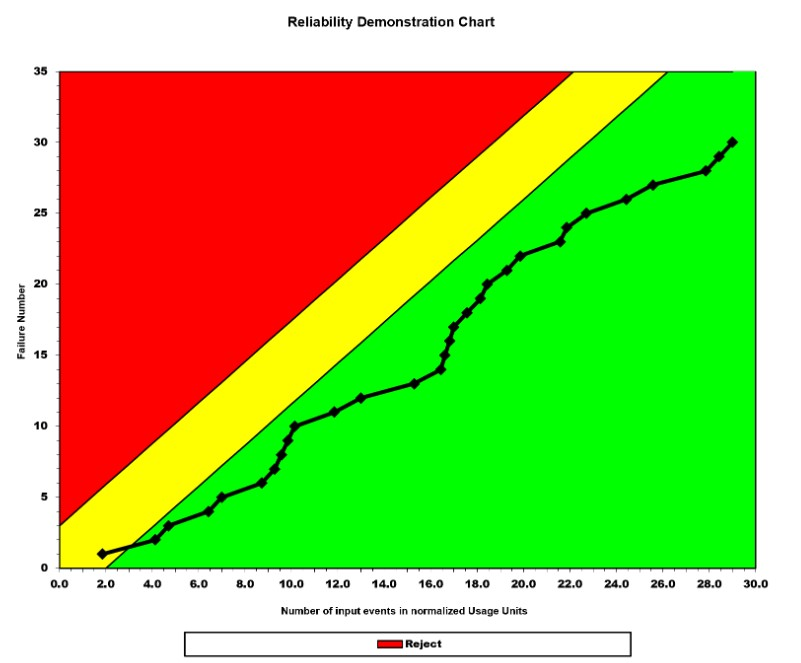

This RDC plot uses the regular value of MTTFmin at 105 seconds per failure, therefore the target Failure Intensity Objective (FIO) is 0.00952381 failures per second. As displayed in the plot, for a brief moment at the beginning, the system is in the continue region but soon after moves into the accept region and stays in the accept region until the end of testing.

## Plot for half of MTTFmin:

This RDC plot uses the regular value of half the MTTFmin at 52.5 seconds per failure, therefore the target Failure Intensity Objective (FIO) is 0.01904762 failures per second. As displayed in the plot, the system is in the accept region for all of the testing, this is because the MTTF value was halved resulting in a FIO where more failures are acceptable within a given time period.

## Plot for twice MTTFmin:
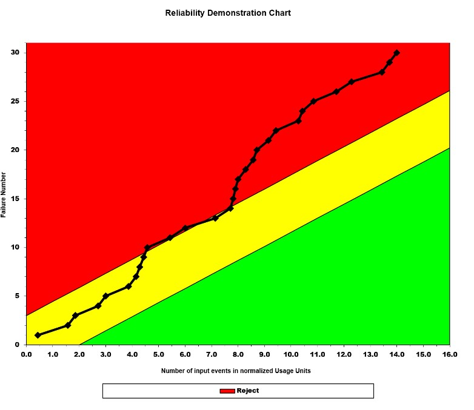

This RDC plot uses the regular value of double the MTTFmin at 210 seconds per failure, therefore the target Failure Intensity Objective (FIO) is 0.0047619 failures per second. As displayed in the plot, the system starts in the continue region, but then enters and remains in the reject region until the end of testing. This is because the MTTF value was doubled resulting in a stricter acceptance condition with a FIO where less failures are acceptable within a given time period.

# 

### RDC advantages:
* Very fast and easy way to analyze data
* Very reusable
* Can be used with smaller along with larger data sets
* Outputs a simple visual chart, making it easier to interpret and assess reliability 

### RDC disadvantages:
* Does not specifically say what is the root cause of failures that affect the reliability
* Only really gives a yes or no answer upon the reliability of the SUT where it is either acceptable or not

# Comparison of Results

In part 1 reliability growth testing, the SUT was analyzed by using the test data and fitting different models to this data. The two best models were then selected and used to predict the future performance of the SUT. By analyzing the plots showing the models predictions, we saw that both models predicted a decrease in failure intensity and an increase in reliability as future testing continues. We also analyzed the system’s current failure rate and spoke about that when given a certain target failure rate, how a decision about the system’s acceptability could occur. In combination, these predictions and comparisons can lead a team to make a decision about the further testing and readiness for the SUT to release.

In part 2, the Reliability Demonstration Chart was used to assess the reliability of the SUT and whether the SUT should be rejected, continue testing, or accepted. We saw how different target failure rates would result in a different MTTFmin which would influence whether the current rate of failure that the SUT is exhibiting is acceptable or not.

Altogether, part 1 and part 2 can be used by teams to assess the reliability of the SUT and its readiness to be released. Part 2 RDC testing provided more of a yes or no answer to whether the SUT was acceptable and Part 1 provided insight as to what the future reliability of the SUT would look like if testing were to continue. These metrics taken together with the current/past performance data exhibited by the SUT can be used to determine whether the system is acceptable and ready to release.

# Discussion on Similarity and Differences of the Two Techniques
Both techniques are useful in measuring the reliability of a system and identifying failure points which assists in fixing bugs and improving quality of the system. Both techniques are also based on inter failure times and MTTF. However, RDC also involves risk parameters to help define the boundaries of the accept, reject, and continue regions. RDC is used for making decisions on whether to accept or reject a system or an acquired component, while the reliability growth technique is used as a tool for guiding the software testing process and for determining if the system is ready for release by checking if it passes acceptance tests.

# How the team work/effort was divided and managed
Teamwork was divided evenly.
# 

# Difficulties encountered, challenges overcome, and lessons learned
While trying to work with the SRTAT and CS-FRAT tools, we encountered several challenges. One of the significant challenges was dealing with the wrong format of data files, which required conversion to the right format. However, even after converting the data files, they would not necessarily work, causing further confusion and delays. In addition, for CS-FRAT, we learned that we had to have a specific format for the data consisting of five columns, two of which were unclear, which added more complexity to the process. We eventually discovered that we were able to use SFRAT using one of the failure data documents provided in the lab artifacts, though some additional steps were needed as we had to convert the document file to the correct format for SFRAT to read the data.

# Comments/feedback on the lab itself
It would be appreciated if it were made known which files were compatible with which testing tool in part 1.
