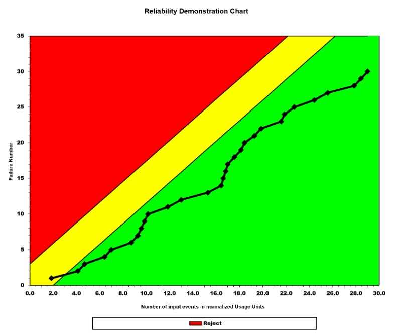
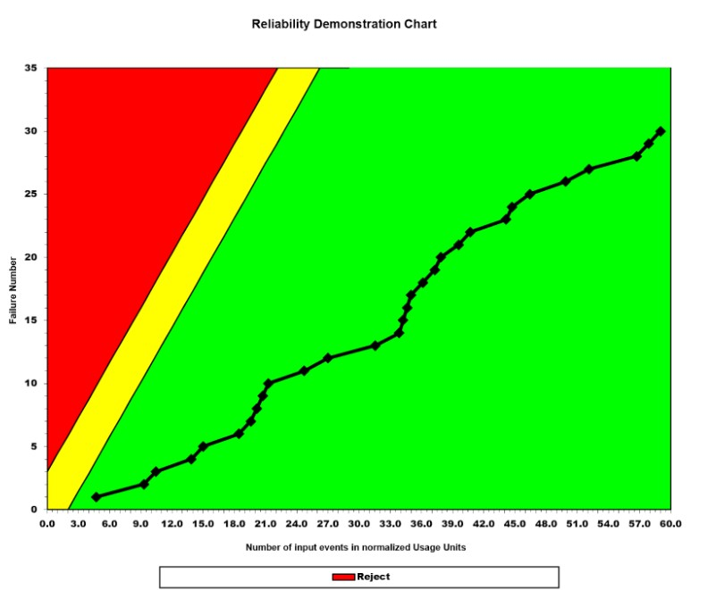

**SENG 438- Software Testing, Reliability, and Quality**

**Lab. Report \#5 – Software Reliability Assessment**

| Group 11:       |   |
|-----------------|---|
| Jam Ivy Gammuac |   |
| Thomas Kusinski                |   |
| Austin Lee                |   |
| Shanelle Li Chit Khim                |   |

# Introduction
This lab was conducted to gain experience with measuring the reliability of a system using reliability assessment tools. Two techniques of assessing failure data were used: reliability growth testing and reliability demonstration chart. The failure data we analyzed was the data contained in Failure Report #9 which was provided in the lab artifacts. The tools used for this lab were: SFRAT for reliability growth testing and RDC excel sheet for the reliability demonstration chart. From these two exercises we were able to learn how to analyze test data to determine the reliability of an SUT, as well as gain an understanding of when it is useful to use different techniques of failure data assessment.

# 

# Assessment Using Reliability Growth Testing 

## Decision Making Using a Given Failure Rate:
To make a decision about the system’s reliability, when using a given target failure rate as criteria, you should compare the target failure rate to what the system’s current failure rate is at and use the results of that comparison to guide your decision. For example if the system’s current failure rate is more than the target failure rate, this indicates more failures are occurring than what is acceptable so testing should continue as the system has not yet reached the target acceptable level of reliability. 

In our system under test, we used data from Failure Report #9. As displayed in the calculations below, we calculated the MTTF of the system and calculated the reciprocal of the calculated MTTF to obtain the system’s current failure rate at 0.00952381 failures per second. 

In this lab we were not provided with a target failure rate but, if the given target failure rate were to be a smaller value than our SUT’s current failure rate of 0.00952381 failures per second, then that indicates the system is not at an acceptable level of reliability yet so the decision that should be made is to continue testing. If the given target failure rate were to be a larger value than our SUT’s current failure rate of 0.00952381 failures per second, then that indicates the system is at an acceptable level of reliability indicating that the system is ready for release and the decision to release the system can be made.

# Assessment Using Reliability Demonstration Chart 
Using Failure Report 9 data

Using the RDC-11 excel spreadsheet that was provided in the A5-artifacts, we prepared 3 plots for the failure data in Failure Report #9. For each of these plots, we used typical (default) values of the discrimination ratio of 2.0, the customer risk at 0.1 (10%), and the developer risk at 1.0 (10%). 

Using typical (default values):
Discrimination ratio: 2
Customer Risk: 10%
Developer Risk: 10%

## Justification of MTTFmin
To determine the MTTFmin, we just used the system's current MTTF extracted from the data in Failure Report #9, due to the absence of a target failure rate being provided. To determine the MTTF, we used the formula that the MTTF = Average failure rate which would be the equivalent to the Total testing time/Total number of failures. From the data in Failure Report #9, in total 3150 seconds elapsed and 30 failures occurred so we calculated a MTTF of 105 seconds per failure as seen below. Since we were using MTTF as the MTTFmin, the MTTFmin was also 105 seconds per failure.

MTTFmin = MTTF = Total Testing Time/Total Number of Failures =3150 seconds/30 failures = 105 seconds per failure 

## Plot for MTTFmin:

This RDC plot uses the regular value of MTTFmin at 105 seconds per failure, therefore the target Failure Intensity Objective (FIO) is 0.00952381 failures per second. As displayed in the plot, for a brief moment at the beginning, the system is in the continue region but soon after moves into the accept region and stays in the accept region until the end of testing.

## Plot for half of MTTFmin:

This RDC plot uses the regular value of half the MTTFmin at 52.5 seconds per failure, therefore the target Failure Intensity Objective (FIO) is 0.01904762 failures per second. As displayed in the plot, the system is in the accept region for all of the testing, this is because the MTTF value was halved resulting in a FIO where more failures are acceptable within a given time period.

## Plot for twice MTTFmin:

This RDC plot uses the regular value of double the MTTFmin at 210 seconds per failure, therefore the target Failure Intensity Objective (FIO) is 0.0047619 failures per second. As displayed in the plot, the system starts in the continue region, but then enters and remains in the reject region until the end of testing. This is because the MTTF value was doubled resulting in a stricter acceptance condition with a FIO where less failures are acceptable within a given time period.

# 

# Comparison of Results

# Discussion on Similarity and Differences of the Two Techniques
Both techniques are useful in measuring the reliability of a system and identifying failure points which assists in fixing bugs and improving quality of the system. Both techniques are also based on inter failure times and MTTF. However, RDC also involves risk parameters to help define the boundaries of the accept, reject, and continue regions. RDC is used for making decisions on whether to accept or reject a system or an acquired component, while the reliability growth technique is used as a tool for guiding the software testing process and for determining if the system is ready for release by checking if it passes acceptance tests.

Reliability Growth Testing advantages:
* Can use inter failure time and/or failure count
* Aids in tracking bugs in pre-release
* Data can be analyzed through trend tests, which help decide if system is having reliability growth, decrease, or stability
* Provides a means to quantify the reliability improvement during testing and development

Reliability Growth Testing disadvantages:
* Requires large data set and data needs to be accurate

RDC advantages:
* Very fast and easy way to analyze data
* Very reusable
* Can be used with smaller along with larger data sets
* Outputs a simple visual chart, making it easier to interpret and assess reliability 

RDC disadvantages:
* Does not specifically say what is the root cause of failures that affect the reliability

# How the team work/effort was divided and managed

# 

# Difficulties encountered, challenges overcome, and lessons learned
While trying to work with the SRTAT and CS-FRAT tools, we encountered several challenges. One of the significant challenges was dealing with the wrong format of data files, which required conversion to the right format. However, even after converting the data files, they would not necessarily work, causing further confusion and delays. In addition, for CS-FRAT, we learned that we had to have a specific format for the data consisting of five columns, two of which were unclear, which added more complexity to the process. Ultimately, to overcome these obstacles, we had to resort to using one of the sample data files provided with the tools, which may not have been an ideal solution, but it allowed us to proceed with the lab.

# Comments/feedback on the lab itself
